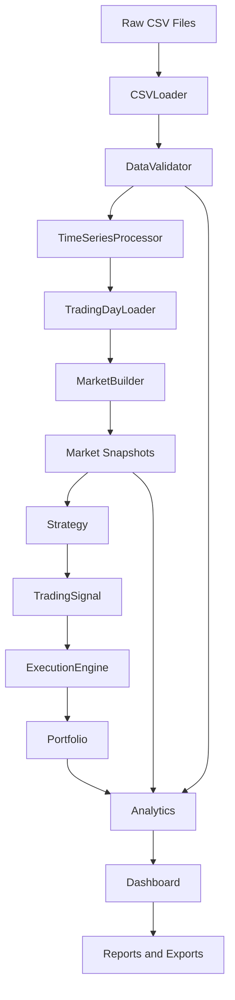
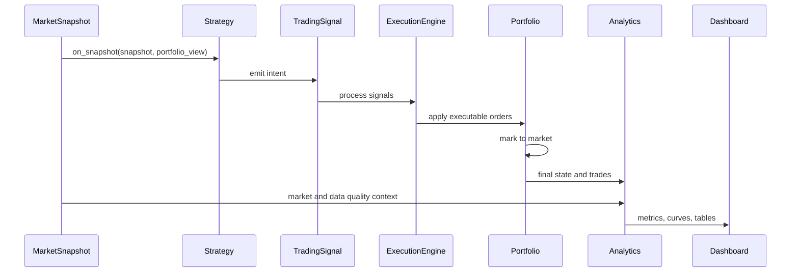

# BackTester And Visualizer

A modular options backtesting and research-reporting platform for intraday
index option strategies. The project loads raw NSE CSV files, validates and
normalizes market data, builds synchronized market snapshots, runs a strategy
through a frozen execution and portfolio engine, then produces analytics,
exports, an interactive dashboard, and professional reports.

The goal is to let a quantitative researcher answer three questions without
reading source code:

- What happened?
- Why did it happen?
- Should I trust this strategy?

## Assignment

The assignment is to backtest an ATM straddle-style strategy on one trading day
of futures and options data. The engine must handle sparse option quotes,
incomplete option pairs, market synchronization, ATM strike rollover, portfolio
accounting, trade history, analytics, dashboarding, and exportable reports.

## Features

- [x] Modular architecture
- [x] Strategy plug-in framework
- [x] Portfolio and MTM accounting
- [x] Analytics layer
- [x] Interactive dashboard
- [x] HTML and PDF reports
- [x] Data validation
- [x] Data quality metrics
- [x] Trade export
- [x] Interactive visualizations

## Architecture



### Runtime Sequence



## Pipeline

One trading day flows through the system as follows:

1. `CSVLoader` reads raw tick CSV files and normalizes one row per second.
2. `DataValidator` checks schema, missing values, prices, timestamp order, and
   duplicate timestamps.
3. `TimeSeriesProcessor` builds dense futures series and sparse option series.
4. `TradingDayLoader` loads futures and nearest-expiry options, retaining only
   complete CE/PE option pairs.
5. `MarketBuilder` synchronizes futures and options into tradable snapshots.
6. `Strategy` reads each snapshot and emits `TradingSignal` intent.
7. `ExecutionEngine` converts signals into executable orders.
8. `Portfolio` owns positions, cash, closed trades, realized PnL, unrealized
   PnL, and MTM.
9. `Analytics` consumes final portfolio state, trades, markets, validation
   results, configuration, and runtime metadata.
10. `Dashboard`, `Reports`, and `Exports` present the run.

## Folder Structure

`data/` contains CSV loading, filename parsing, time-series processing,
validation, quote indexing, trading-day loading, and market building.

`engine/` contains the frozen backtesting orchestration, strategy contract,
ATM straddle strategy, execution engine, and portfolio.

`models/` contains immutable and structured domain objects such as instruments,
orders, positions, trades, market snapshots, option quotes, futures quotes, raw
market data, validation results, and enums.

`analytics/` contains generic analytics models/calculations, ATM strategy
insights, and comparison helpers.

`dashboard/` contains the single-file Plotly dashboard generator.

`reporting/` contains JSON/CSV exports plus HTML and PDF report generation.

`docs/` contains user-facing documentation and architecture notes.

`tests/` contains regression tests for the engine and analytics/reporting layer.

`results/` contains generated outputs from the latest run.

## Installation

Use Python 3.11+.

```powershell
python -m pip install pandas pytest
```

The dashboard uses Plotly from a CDN when `results/dashboard.html` is opened in
a browser.

## Running

Run the full research workflow:

```powershell
python run_research_backtest.py --data NSE_20221118 --output results --initial-cash 1000000
```

Optional metadata:

```powershell
python run_research_backtest.py `
  --data NSE_20221118 `
  --output results `
  --initial-cash 1000000 `
  --project-version 1.0.0 `
  --engine-version 1.0.0 `
  --author "Your Name"
```

Run tests:

```powershell
pytest -q
```

## Dashboard

Open:

```text
results/dashboard.html
```

The dashboard contains:

- Executive KPI cards
- Cumulative performance chart
- Realized drawdown chart
- Daily PnL and cumulative PnL
- Trade PnL histogram
- Holding-time histogram
- Holding-time vs PnL scatter plot
- ATM strike and futures timeline
- CE/PE/combined premium timeline
- Data quality summary
- Runtime breakdown
- Searchable, sortable, paginated trade table
- Daily summary, validation, and configuration tables

## Reports

Generated report files:

- `results/report.html`
- `results/report.pdf`

The reports include project metadata, table of contents, executive summary,
architecture summary, performance summary, trade statistics, risk metrics, data
quality, engineering statistics, validation summary, and conclusions.

## Result Files

`summary.json` contains the executive summary, data-quality summary, and system
metrics.

`analytics.json` contains the full analytics payload used by dashboards and
reports.

`trades.csv` contains one row per closed trade.

`daily_summary.csv` contains one row per trading day.

`positions.csv` contains open positions at the end of the run.

`configuration.json` contains run configuration and metadata.

`validation_report.json` contains validation warnings and errors.

## Extending

To add a new strategy:

1. Create a class that inherits from `engine.strategy.Strategy`.
2. Implement `on_snapshot(snapshot, portfolio_view)`.
3. Return one or more `TradingSignal` objects.
4. Register the strategy in a runner with `Backtester.add_strategy`.
5. Add a strategy-specific analytics helper only if the strategy needs metrics
   beyond the generic analytics layer.

Strategies emit `TradingSignal` objects instead of orders so the execution
engine remains the single place that translates intent into executable orders.
This keeps strategy logic independent of execution rules and portfolio
mutation.

## Engineering Challenges

Sparse option data: option contracts do not trade every second. The market
builder resolves the last known option quote at or before the futures timestamp.

Incomplete option pairs: a CE without a PE, or a PE without a CE, cannot be
traded by a pair strategy. The loader filters incomplete strikes.

Market synchronization: dense futures timestamps drive the simulation timeline,
while sparse option quotes are aligned into snapshot option chains.

ATM rollover: the ATM strike is computed from tradable strikes available in the
snapshot. Strategy rollover is triggered when the held strike differs from the
current ATM strike.

Modular architecture: each layer owns one responsibility. Portfolio owns
positions and PnL state. Analytics consumes outputs and never mutates the
engine.

## Screenshots

Place screenshots in `docs/screenshots/` before final submission.

Suggested captures:

- Dashboard Overview: `docs/screenshots/dashboard-overview.png`
- PnL Curve: `docs/screenshots/pnl-curve.png`
- Trade Table: `docs/screenshots/trade-table.png`

## Known Instrumentation Limits

The frozen engine does not currently expose structured audit counters for
signals generated, orders generated, or orders executed. Those analytics fields
remain `null` unless supplied externally.

Forward-filled quote counts are also `null` because the current data pipeline
does not expose that count as structured metadata.
