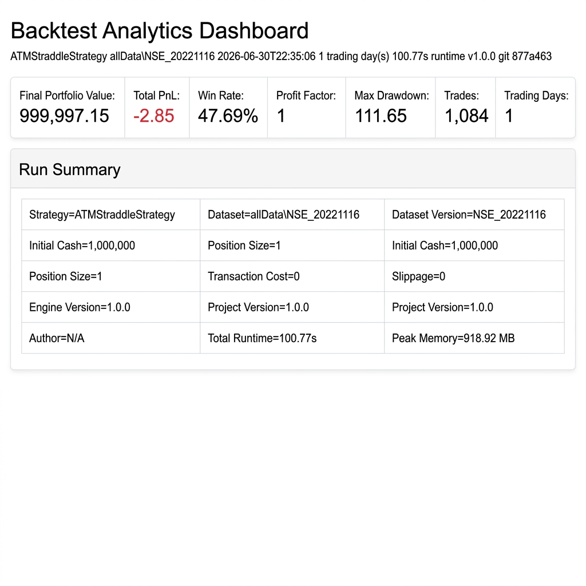
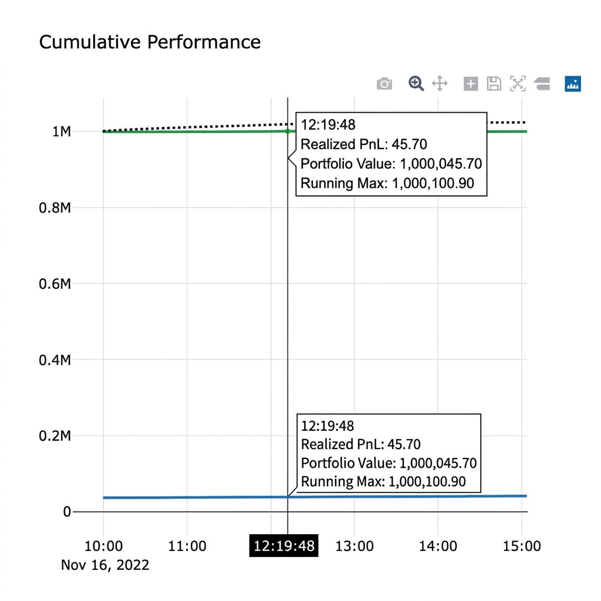
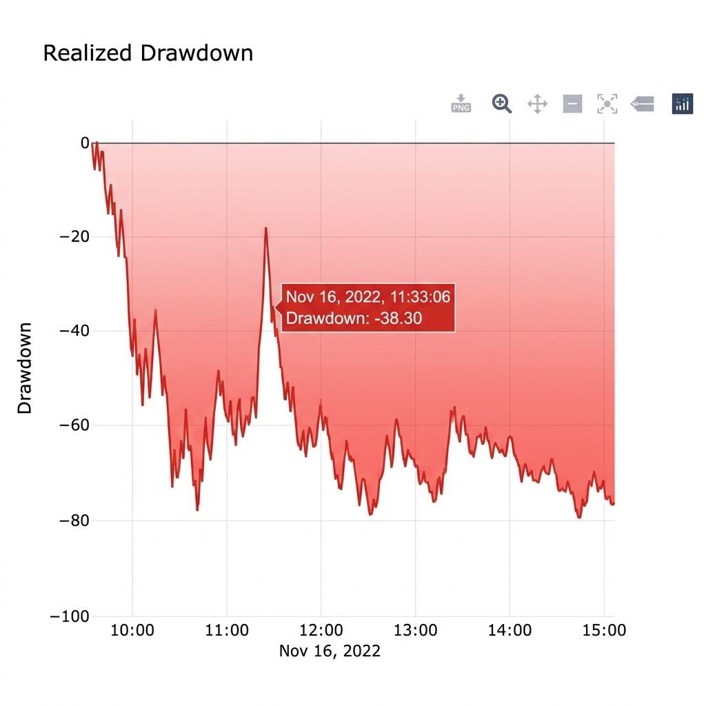
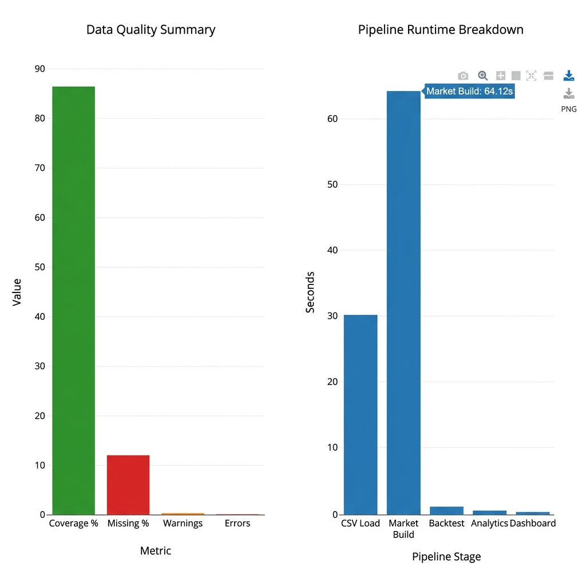
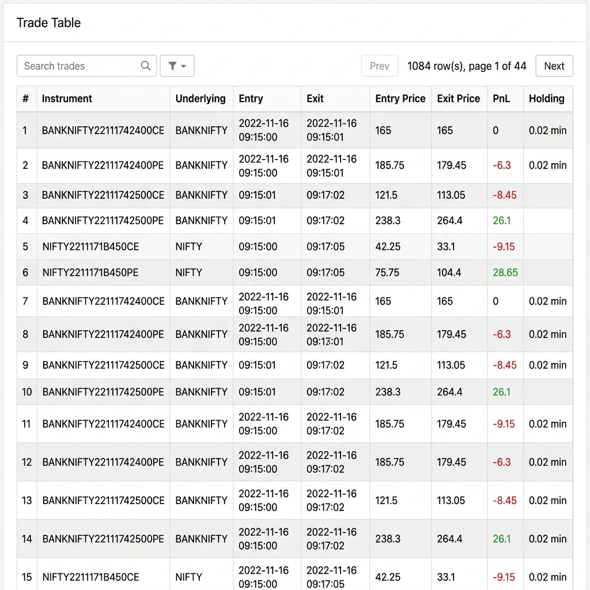
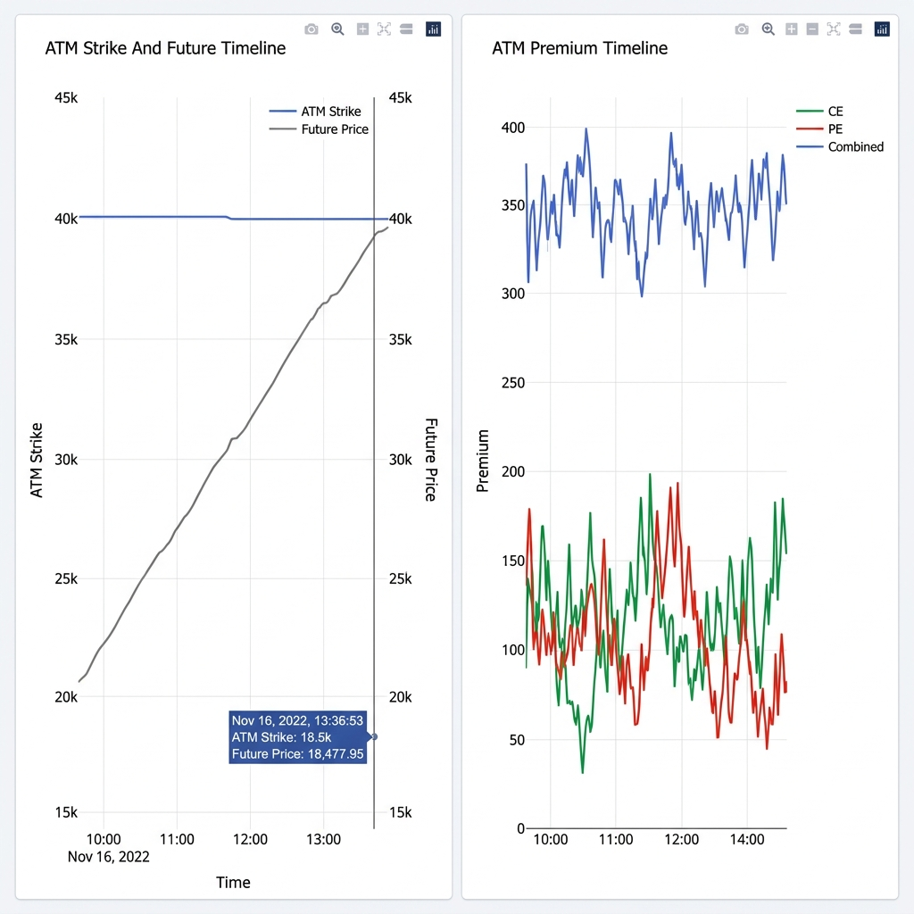
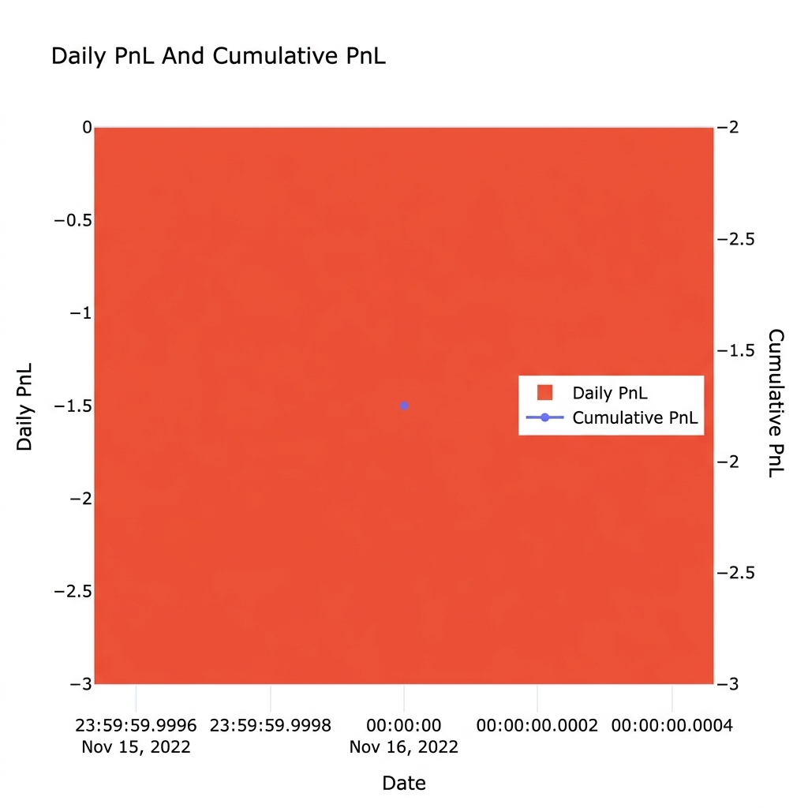
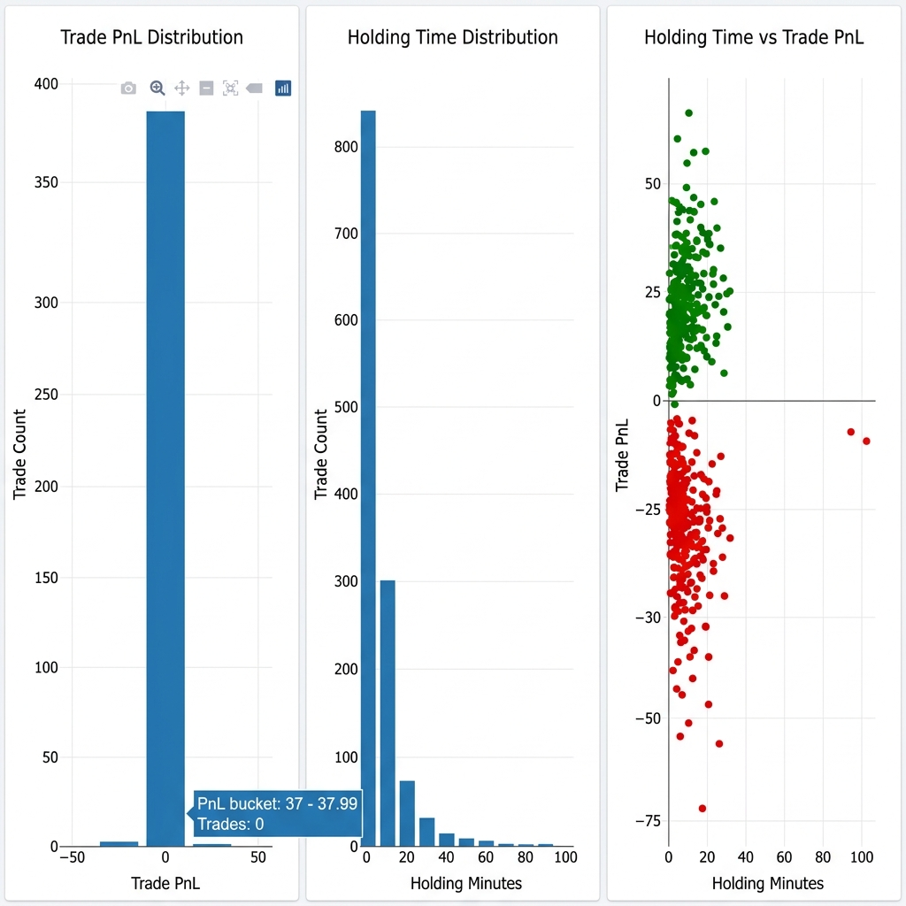
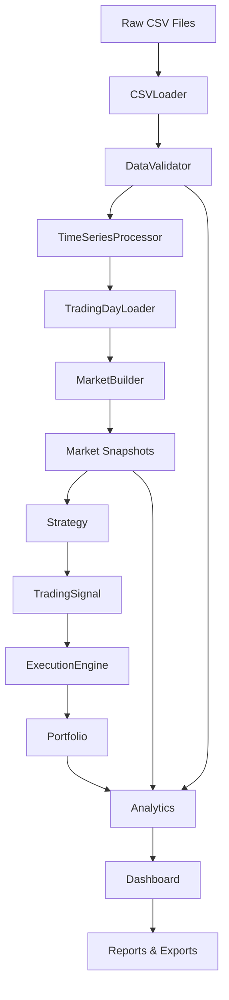

# BackTester & Visualizer

Modular options backtesting framework for intraday index option strategies — with analytics, an interactive dashboard, and HTML/PDF reports.

---

## Preview


*KPI cards and run summary — strategy metadata, performance metrics, runtime*


*Realized PnL, portfolio value, and running maximum over the trading session*


*Intraday drawdown profile across the full trading session*


*Data coverage metrics and per-stage pipeline runtime breakdown*


*Searchable, paginated trade log — 1,084 trades across NIFTY and BANKNIFTY*


*ATM strike tracking alongside futures price, and live CE / PE / combined premium over the session*


*Daily PnL bar and cumulative PnL line — per-day view for multi-day runs*


*Trade PnL distribution, holding-time histogram, and holding time vs PnL scatter*

---

## Features

- [x] CSV market data loader with schema validation
- [x] Sparse option quote handling (last known price, no fabrication)
- [x] Incomplete option pair filtering (CE+PE required)
- [x] Market synchronization — futures-driven timeline, options aligned
- [x] Pluggable strategy framework (`Strategy` base class)
- [x] ATM straddle strategy with intraday strike rollover
- [x] Execution engine — signals → orders, deduplication guard
- [x] Portfolio with MTM, realized PnL, unrealized PnL
- [x] End-of-day forced liquidation with last-known-price fallback
- [x] Analytics layer — performance, drawdown, equity curve, data quality
- [x] Interactive Plotly dashboard (single HTML file, no server)
- [x] HTML and PDF reports
- [x] CSV/JSON exports — trades, positions, summary, configuration
- [x] Multi-day batch runner

---

## Architecture



---

## Project Structure

```
analytics/          # Performance metrics, equity curves, data quality
dashboard/          # Plotly dashboard generator
data/               # CSV loading, validation, time-series, market building
docs/               # Architecture notes, user guide, screenshots
engine/             # Backtester, strategy, execution engine, portfolio
models/             # Domain objects — instruments, orders, positions, trades
reporting/          # HTML/PDF reports, CSV/JSON exports
tests/              # Regression tests
run_research_backtest.py
```

---

## Installation

Requires **Python 3.11+**

```bash
pip install pandas pytest
```

The dashboard uses Plotly from CDN — no additional install needed.

---

## Running

**Single trading day**

```bash
python run_research_backtest.py --data NSE_20221118 --output results
```

**Full dataset (multi-day)**

```bash
python run_research_backtest.py --data allData --output results
```

**Tests**

```bash
pytest -q
```

---

## Dashboard

Open `results/<day>/dashboard.html` in any browser.

Includes:

- KPI cards — portfolio value, PnL, win rate, profit factor, drawdown, trades
- Cumulative performance — realized PnL, portfolio value, running maximum
- Realized drawdown chart
- Daily PnL and cumulative PnL
- Trade PnL histogram and holding-time histogram
- ATM strike and futures price timeline
- CE / PE / combined premium timeline
- Data quality summary and pipeline runtime breakdown
- Searchable, paginated trade table with color-coded PnL
- Daily summary, validation report, and configuration tables

---

## Reports & Exports

Each run produces the following inside the output directory:

| File | Contents |
|------|----------|
| `dashboard.html` | Full interactive Plotly dashboard |
| `report.html` | Formatted HTML research report |
| `report.pdf` | PDF version of the report |
| `analytics.json` | Complete analytics payload |
| `summary.json` | Executive summary and system metrics |
| `trades.csv` | One row per closed trade |
| `daily_summary.csv` | One row per trading day |
| `positions.csv` | Open positions at end of run (empty on clean runs) |
| `configuration.json` | Run configuration and metadata |
| `validation_report.json` | Data validation warnings and errors |

---

## Supported Underlyings

The data pipeline and market builder are generalized. The engine supports:

- **NIFTY**
- **BANKNIFTY**
- **FINNIFTY**

Underlyings absent from the dataset are safely ignored.

---

## Assumptions

- Nearest expiry contracts only
- Position size = 1 lot
- Market order execution at quoted price
- No brokerage or transaction costs
- No slippage
- No overnight positions — all positions are closed at end of day
- When an option quote is missing at a given timestamp, the last known quote is used

---