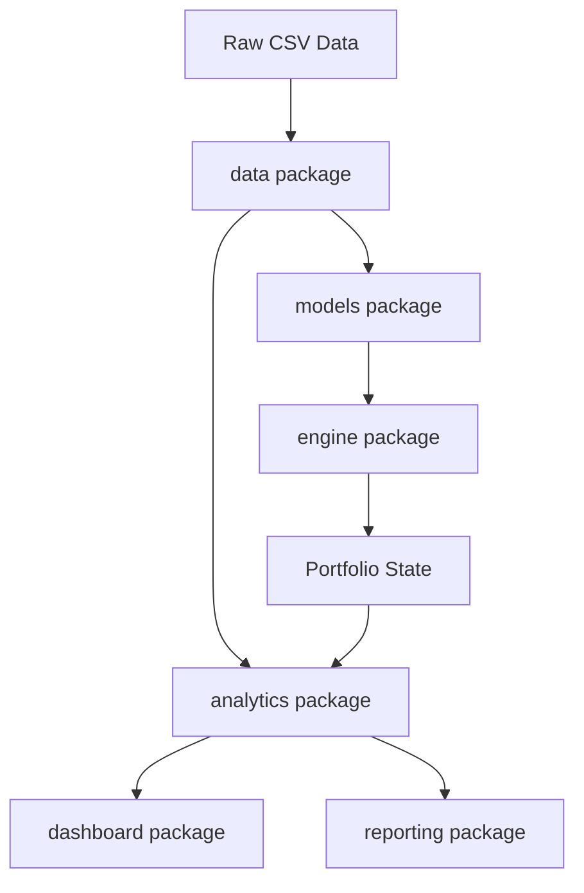

# Architecture

The repository is organized as a layered quantitative research platform. The
engine is intentionally separated from analytics and presentation so that
strategy execution remains deterministic and reporting can evolve independently.

## Package Responsibilities

### `data`

`CSVLoader` reads raw NSE CSV files and normalizes tick data into typed
DataFrames.

`FilenameParser` converts NSE filenames into `Instrument` models.

`DataValidator` checks schema, missing values, non-positive prices, timestamp
ordering, and duplicate timestamps.

`TimeSeriesProcessor` builds dense futures time series and sparse option series.

`TradingDayLoader` loads one trading-day directory, identifies nearest option
expiries, validates files, and keeps only complete CE/PE option pairs.

`market_builder.build_markets` builds `Market` objects from `RawMarketData`.
Futures drive the timeline. Option quotes are resolved at or before the current
timestamp.

### `models`

Models represent the domain language:

- `Instrument`
- `FutureQuote`
- `OptionQuote`
- `OptionPairQuote`
- `MarketSnapshot`
- `Market`
- `TradingSignal`
- `Order`
- `Position`
- `Trade`
- `PortfolioView`
- `RawMarketData`
- `ValidationResult`

Enums such as `Underlying`, `OptionType`, `OrderAction`, and
`ValidationSeverity` keep values consistent across packages.

### `engine`

`Strategy` defines the strategy interface.

`ATMStraddleStrategy` implements the assignment strategy by emitting trading
intent.

`ExecutionEngine` converts trading signals into orders using current market
prices.

`Portfolio` owns cash, positions, trade history, realized PnL, unrealized PnL,
and MTM.

`Backtester` orchestrates chronological simulation across markets and
strategies.

### `analytics`

`build_analytics` consumes final portfolio state, trades, markets, validation
results, configuration, and runtime metadata. It produces serializable metrics,
curves, trade rows, daily summaries, positions, and validation rows.

`strategy_insights.build_atm_strategy_insights` computes ATM-straddle-specific
metrics outside the generic calculator.

`comparison.compare_analytics` provides a compact structure for comparing
multiple backtest results.

### `dashboard`

`generate_dashboard` writes a single-file interactive Plotly dashboard. It does
not run the backtest and does not mutate analytics results.

### `reporting`

`export_results` writes JSON and CSV files.

`generate_html_report` writes a print-friendly report.

`generate_pdf_report` writes a lightweight PDF summary without external PDF
dependencies.

## Relationships



## SOLID Design Notes

Single Responsibility: each package has a narrow role. Loading, validation,
market construction, strategy, execution, portfolio, analytics, and reporting
are separate.

Open/Closed: new strategies can be added by implementing `Strategy` without
modifying `Backtester`, `ExecutionEngine`, or `Portfolio`.

Liskov Substitution: any class implementing the `Strategy` interface can be
registered for an underlying.

Interface Segregation: strategies receive `PortfolioView`, not the mutable
portfolio. This gives strategies only the information they need.

Dependency Inversion: higher-level orchestration depends on abstractions such
as `Strategy` and domain models rather than concrete data files.

## Why Strategy Emits TradingSignals

Strategies should express intent, not execution mechanics. A strategy knows it
wants to enter or exit, but it should not own pricing, order construction, or
portfolio mutation. `TradingSignal` creates a boundary between research logic
and execution rules.

## Why Portfolio Is Independent

Portfolio owns accounting state only:

- Cash
- Open positions
- Closed trades
- Realized PnL
- Unrealized PnL
- MTM

It does not load data, generate signals, build markets, or create reports. This
keeps accounting testable and prevents analytics from altering trading state.

## Why Analytics Is Independent

Analytics is a pure consumer layer. It receives portfolio state, trade history,
market statistics, validation results, configuration, and metadata. It produces
metrics and presentation-ready rows. It never changes the portfolio or reruns
execution.

This separation is important because research reporting should not be able to
change backtest results.

## Adding Another Strategy

1. Create a new class in `engine/` or a strategy package.
2. Inherit from `engine.strategy.Strategy`.
3. Implement `on_snapshot(snapshot, portfolio_view)`.
4. Return `TradingSignal` objects.
5. Register the strategy in a runner:

```python
backtester.add_strategy(Underlying.NIFTY, MyStrategy())
```

6. Add tests for signal behavior.
7. Add optional strategy-specific analytics in `analytics/` if the strategy has
   unique metrics.

Do not modify `ExecutionEngine` unless a new signal type genuinely requires new
execution behavior.

## Key Engineering Decisions

Sparse option data is handled by sparse quote indices. The latest known quote at
or before a futures timestamp is used.

Incomplete option pairs are filtered because pair strategies require both CE and
PE legs.

Market snapshots are immutable views of tradable state at a timestamp.

The portfolio view passed to strategies is read-only.

Analytics and reports use serializable dataclasses to keep outputs stable and
easy to inspect.
